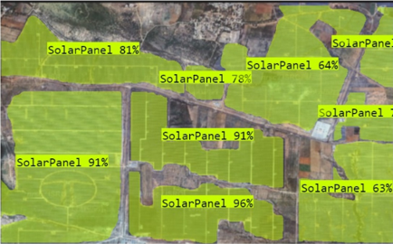
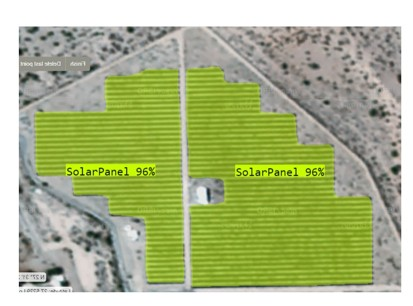
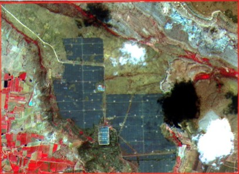
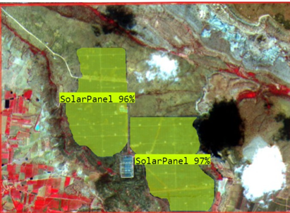
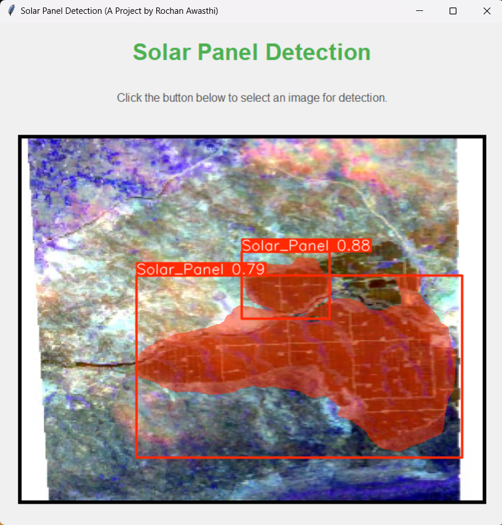

# Solar Panel Extraction from Satellite Imagery

## Overview
This project utilizes a custom-trained YOLOv8 instance segmentation model to detect and extract solar panels from satellite images. The primary goal is to enable accurate identification of solar installations for energy monitoring, environmental impact assessment, and disaster recovery applications.
## Features
- Instance segmentation using YOLOv8 for precise solar panel detection
- Custom-trained model on a specialized dataset of satellite images.
- Graphical User Interface (GUI) developed using Tkinter for easy interaction.
- High-performance training results, achieving mAP: 86.7, Precision: 89.8, Recall: 79 after 300 epochs.
- Future enhancements include dataset improvements, model refinements, and deployment as a web API. 

## Installation
1. Clone the repository:  git clone https://github.com/your-username/solar-panel-extraction.git

2. Install dependencies:  pip install -r requirements.txt

3. Navigate to the `main_code` directory:  cd main_code

4. Run the 'main.py' file: python main.py

## Dataset  
- A total of 1,187 images were collected from Bhoonidhi and various other satellite imagery sources.
- Images were in TIFF format, which were processed and converted using QGIS for compatibility with the model.
- Manual annotation was performed to label solar panels for training the YOLOv8 instance segmentation model.

## Training Details
- Model was trained for 300 epochs to achieve optimal performance.
- Achieved metrics:
    - mAP (Mean Average Precision): 86.7%
    - Precision: 89.8%
    - Recall: 79%

 
## Example Image  

## Future Impact & Applications

### Energy Monitoring & Management
- Utility companies can monitor and optimize solar panel installations, improve energy distribution, and plan new installations efficiently.
###  Environmental Impact Assessment
- Supports sustainability reporting by tracking and reporting the impact of solar installations on sustainability goals and carbon footprint reduction.

### Disaster Response & Recovery
- Enables damage assessment of solar installations post-disaster to facilitate quicker recovery and repair efforts.

## Future Plans

- Enhancing dataset quality with additional images and improved annotations.
- Fine-tuning model accuracy using advanced hyperparameter tuning techniques.
- Deploying the model as a web API for broader accessibility and real-time analysis.

## Contributors  
- Rochan Awasthi (https://github.com/Macbeth1501)  
- Sayali Bambal (https://github.com/SayaiB24)  
